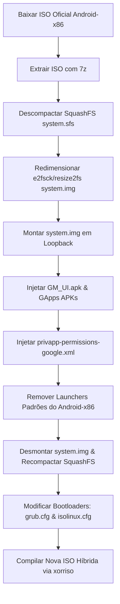

# GM OS Mobile: Guia de Remasterização e Arquitetura do Sistema

Este documento descreve as diretrizes técnicas detalhadas, arquiteturas de software e processos de automação para transformar a ISO oficial do Android-x86 no **GM OS Mobile**.

Nossa abordagem foca na **remasterização cirúrgica** da imagem do sistema (`system.img`), eliminando a necessidade de compilação do Android Open Source Project (AOSP) do zero. Injetaremos uma interface customizada em Kotlin (GM UI) e os serviços do Google (GApps), otimizando a experiência para execução no VirtualBox.

---

## Estrutura de Arquivos Criada no Workspace

Para apoiar este projeto, a estrutura padrão de código foi gerada no seu workspace:
* **[AndroidManifest.xml](file:///c:/Users/dvian/OneDrive/Documentos/Desktop/Documentos/Meus%20Projetos/GMOS%20mobile/app/src/main/AndroidManifest.xml)**: Configuração do Launcher como tela inicial padrão.
* **[activity_main.xml](file:///c:/Users/dvian/OneDrive/Documentos/Desktop/Documentos/Meus%20Projetos/GMOS%20mobile/app/src/main/res/layout/activity_main.xml)**: Layout de tela dividida (Barra lateral esquerda + Desktop workspace).
* **[item_app.xml](file:///c:/Users/dvian/OneDrive/Documentos/Desktop/Documentos/Meus%20Projetos/GMOS%20mobile/app/src/main/res/layout/item_app.xml)**: Layout dos ícones dos aplicativos.
* **[MainActivity.kt](file:///c:/Users/dvian/OneDrive/Documentos/Desktop/Documentos/Meus%20Projetos/GMOS%20mobile/app/src/main/java/com/gmos/ui/MainActivity.kt)**: Lógica de listagem de aplicativos e Drag-and-Drop.
* **[privapp-permissions-google.xml](file:///c:/Users/dvian/OneDrive/Documentos/Desktop/Documentos/Meus%20Projetos/GMOS%20mobile/scripts/privapp-permissions-google.xml)**: Whitelist de permissões privilegiadas para evitar falhas do GApps.
* **[remaster.sh](file:///c:/Users/dvian/OneDrive/Documentos/Desktop/Documentos/Meus%20Projetos/GMOS%20mobile/scripts/remaster.sh)**: Script automatizado de reconstrução de ISO (em Bash).
* **[build-iso.yml](file:///c:/Users/dvian/OneDrive/Documentos/Desktop/Documentos/Meus%20Projetos/GMOS%20mobile/.github/workflows/build-iso.yml)**: Pipeline CI/CD do GitHub Actions.

---

## PASSO 1: Arquitetura do Launcher Customizado (GM UI)

O launcher nativo (**GM UI**) atua como a interface principal do sistema. Para que o Android o reconheça como a Home oficial (impedindo o carregamento da interface padrão), registramos a seguinte configuração no `AndroidManifest.xml`:

```xml
<intent-filter>
    <action android:name="android.intent.action.MAIN" />
    <category android:name="android.intent.category.HOME" />
    <category android:name="android.intent.category.DEFAULT" />
</intent-filter>
```

### Layout de Tela Dividida (`activity_main.xml`)
Usamos um `ConstraintLayout` pai para gerenciar duas áreas principais:
1. **Taskbar (Esquerda)**: Barra fixa vertical com largura de `80dp` e esticamento total de altura. Ela contém o botão de gaveta de aplicativos (App Drawer) e uma lista vertical de apps favoritos.
2. **Workspace (Direita)**: Área de Desktop estendida que ocupa o restante da tela, contendo um container secundário (`desktop_shortcuts_container`) onde os atalhos são renderizados.

```xml
<!-- Resumo estrutural do arquivo de layout -->
<androidx.constraintlayout.widget.ConstraintLayout ...>
    <!-- Wallpaper -->
    <ImageView android:id="@+id/img_wallpaper" ... />
    
    <!-- Workspace -->
    <FrameLayout android:id="@+id/workspace"
        app:layout_constraintLeft_toRightOf="@id/taskbar"
        app:layout_constraintRight_toRightOf="parent" ...>
        <FrameLayout android:id="@+id/desktop_shortcuts_container" ... />
    </FrameLayout>

    <!-- Taskbar -->
    <LinearLayout android:id="@+id/taskbar"
        android:layout_width="80dp"
        app:layout_constraintLeft_toLeftOf="parent" ...>
        <ImageButton android:id="@+id/btn_app_drawer" ... />
        <androidx.recyclerview.widget.RecyclerView android:id="@+id/rv_pinned_apps" ... />
        <ImageButton android:id="@+id/btn_settings" ... />
    </LinearLayout>
    
    <!-- App Drawer (Gaveta) -->
    <FrameLayout android:id="@+id/app_drawer_container" ... />
</androidx.constraintlayout.widget.ConstraintLayout>
```

### Lógica de Drag-and-Drop (`MainActivity.kt`)
A implementação utiliza as APIs de arrasto nativas do Android SDK:

1. **Iniciando o Arrasto**: Quando um item na gaveta sofre um *Long Click*, capturamos as informações do aplicativo (Package Name, Activity Class, App Name) e iniciamos o drag com um `View.DragShadowBuilder`.
   ```kotlin
   val dragData = ClipData.newPlainText("APP_LAUNCHER_DATA", "$packageName|$className|$appLabel")
   val shadowBuilder = View.DragShadowBuilder(view)
   view.startDragAndDrop(dragData, shadowBuilder, null, 0)
   ```
2. **Tratamento de Drop no Workspace**: O `desktop_shortcuts_container` escuta os eventos via `View.OnDragListener`. Quando o evento `ACTION_DROP` ocorre, decodificamos os dados do aplicativo e as coordenadas `x, y` relativas:
   ```kotlin
   val dropX = event.x
   val dropY = event.y
   createDesktopShortcut(packageName, className, appLabel, dropX, dropY)
   ```
3. **Instanciação Dinâmica de Atalhos**: Criamos a View do atalho, carregamos seu ícone via `PackageManager`, aplicamos as coordenadas como margens em um `FrameLayout.LayoutParams` e a anexamos na Área de Trabalho.
   ```kotlin
   val shortcutView = LayoutInflater.from(this).inflate(R.layout.item_app, workspace, false)
   val params = FrameLayout.LayoutParams(shortcutSize, shortcutSize).apply {
       leftMargin = (x - (shortcutSize / 2)).toInt().coerceAtLeast(0)
       topMargin = (y - (shortcutSize / 2)).toInt().coerceAtLeast(0)
   }
   desktopShortcutsContainer.addView(shortcutView, params)
   ```

> [!TIP]
> Em produção, armazene as coordenadas `(leftMargin, topMargin)` e o identificador do aplicativo em uma tabela SQLite ou Room. Ao iniciar a `MainActivity`, faça um loop sobre esses registros para reconstruir a Área de Trabalho exatamente como o usuário a deixou.

---

## PASSO 2: Injeção dos Serviços Google (GApps)

Para fornecer suporte à Google Play Store e sincronização de contas sem crashar o sistema operacional, precisamos injetar pacotes específicos de serviços. 

### 1. APKs Obrigatórios e Destinos Exatos
Os pacotes abaixo devem ser injetados em diretórios dedicados dentro da partição `/system` do Android:

| APK Oficial (OpenGApps) | Nome de Pasta Recomendado | Caminho Completo no Sistema |
| :--- | :--- | :--- |
| **Google Services Framework** | `GoogleServicesFramework` | `/system/priv-app/GoogleServicesFramework/GoogleServicesFramework.apk` |
| **Google Play Services** | `PrebuiltGmsCore` | `/system/priv-app/PrebuiltGmsCore/PrebuiltGmsCore.apk` |
| **Google Play Store** | `Phonesky` | `/system/priv-app/Phonesky/Phonesky.apk` |
| **Google Account Manager** | `GoogleLoginService` | `/system/priv-app/GoogleLoginService/GoogleLoginService.apk` |

### 2. A Whitelist de Permissões Privilegiadas (Crucial)
A partir do Android 8.0+, o sistema operacional **recusa-se a inicializar** e entra em bootloop se aplicativos localizados na pasta `/system/priv-app/` solicitarem permissões de assinatura/sistema que não estejam explicitamente declaradas em um arquivo XML de configuração. 

Criamos o arquivo `/system/etc/permissions/privapp-permissions-google.xml` contendo todas as concessões de sistema necessárias para o Google Play Services (`com.google.android.gms`) e Play Store (`com.android.vending`). Ele assegura que permissões críticas (como manipulação de pacotes, configurações seguras e estatísticas de bateria) sejam autorizadas no boot.

### 3. Permissões de Arquivos e Pastas (chmod / chown)
Após copiar os arquivos para a estrutura montada, o script executa correções de propriedade e modo de arquivos para garantir o carregamento do Linux:
* **Diretórios de Aplicativos**: `chmod 755` e `chown 0:0` (root:root)
* **Arquivos APK e XML**: `chmod 644` (leitura global, escrita somente para root) e `chown 0:0` (root:root)

---

## PASSO 3: Script de Remasterização Automatizado

Abaixo está o fluxo lógico executado pelo script de automação estruturado em Bash ([remaster.sh](file:///c:/Users/dvian/OneDrive/Documentos/Desktop/Documentos/Meus%20Projetos/GMOS%20mobile/scripts/remaster.sh)).

### Fluxograma do Processo de Remasterização


### Ajuste de Espaço no Sistema
Para evitar o erro de `No space left on device` durante a injeção do Google Play Services (que é consideravelmente grande), o script executa um incremento físico na imagem ext4 antes de montá-la:
```bash
dd if=/dev/zero bs=1M count=500 >> system.img
e2fsck -f -y system.img
resize2fs system.img
```

### Limpeza de Interface
Para garantir que a **GM UI** assuma imediatamente o controle como tela principal e o usuário não veja caixas de diálogo solicitando escolha de Launcher, o script remove permanentemente as pastas do launcher padrão:
```bash
rm -rf system_mount/system/app/Launcher3
rm -rf system_mount/system/priv-app/Launcher3
rm -rf system_mount/system/app/Taskbar
rm -rf system_mount/system/priv-app/Taskbar
```

---

## PASSO 4: Otimização para o VirtualBox

O Android-x86 executa sobre um ambiente de emulação que requer parametrizações específicas para evitar lags, problemas no cursor do mouse ou ausência de aceleração gráfica.

### 1. Parâmetros de Boot no Kernel
Modificamos o `grub.cfg` (UEFI) e o `isolinux.cfg` (BIOS) injetando argumentos críticos na linha de comando do kernel Linux:

* **`androidboot.selinux=permissive`**: Essencial. Sem isso, os pacotes GApps e o Launcher customizado injetados sofrerão bloqueios de políticas SELinux por não conterem as assinaturas e rótulos de segurança oficiais da compilação inicial. O modo permissivo desativa o bloqueio mas mantém logs ativos.
* **`UVESA_MODE=1280x720` ou `vga=788`**: Define a resolução de tela do buffer gráfico VESA nativo logo na inicialização, impedindo que o Android-x86 inicialize em telas de resoluções inadequadas no VirtualBox.

### 2. Configurações Recomendadas na Máquina Virtual (VirtualBox)

Para garantir fluidez absoluta na execução da ISO customizada:

* **Controlador Gráfico**: Defina como **VMSVGA** e **marque** a caixa **Habilitar Aceleração 3D**. O Android-x86 utiliza drivers Mesa para renderizar o SystemUI e necessita da passagem de chamadas OpenGL para o hardware do host.
* **Memória de Vídeo**: Configure para **128 MB** (máximo permitido).
* **Dispositivo Apontador**: Altere de *Mouse PS/2* para **Tablet USB**. Isto é crítico! O mouse PS/2 tradicional requer captura de tela e causa lag. O protocolo Tablet USB compartilha coordenadas absolutas, fazendo com que o cursor do mouse do seu sistema operacional host navegue de forma transparente e fluida na tela do Android-x86 sem travar.
* **CPU / Processador**: Aloque no mínimo **2 vCPUs**. O compilador JIT/AOT do Android (ART) compila classes em threads de segundo plano no boot e durante a execução. Com apenas 1 núcleo, a interface gráfica sofre gargalos severos de CPU (engasgos de frame).
* **Memória RAM**: Aloque no mínimo **2048 MB (2 GB)** para estabilidade dos serviços adicionados.
